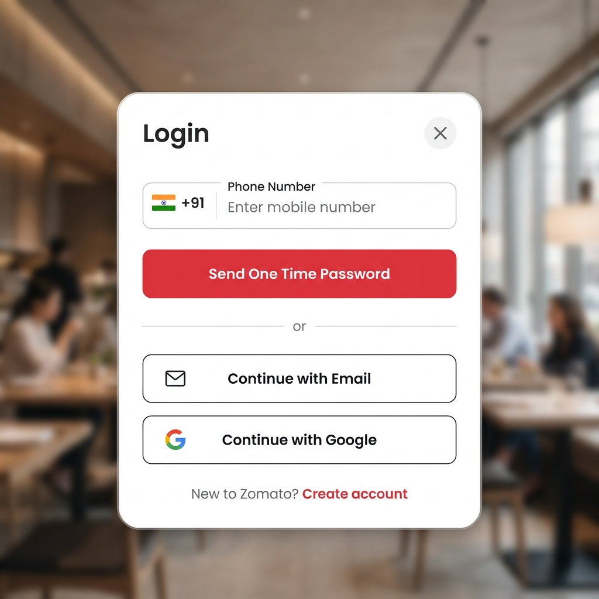

# Interactive Zomato-themed Login Form

A premium, interactive, and responsive login form built using vanilla HTML, CSS, and JavaScript, styled to match the Zomato authentication interface.

## Preview

## Features

- **Outfit Typography**: Uses Google Fonts' Outfit family for modern, clean text.
- **Dynamic Backdrop**: Styled with smooth gradients and floating visual geometric elements.
- **Views Slider**: Transitions smoothly between multiple views (Phone login, 6-digit OTP verification, Email login, and Success views) while auto-adjusting the modal card's height.
- **Country Drawer Code Selector**: A custom mobile-app style drawer that slides up from the card, featuring country search filtering and custom flag icons.
- **Smart OTP Box Autofocus**: Shifts focus forward as digits are typed, shifts back on backspace, and supports copy-paste dispatching.
- **Interactive Toasts**: Rich in-app notifications for successful actions or verification failures.

## File Structure

- `index.html`: The HTML5 document containing the modal structure and custom SVGs.
- `style.css`: Contains CSS root variables, slide layout structures, drawers, transitions, and keyframe animations.
- `script.js`: Handles phone validation, OTP autofocus/timer, view controllers, and toast notifications.
- `login_form_preview.png`: The mockup preview of the login form card.

## How to Run

Simply open `index.html` in any web browser to interact with the form! No build step or local server is required.
